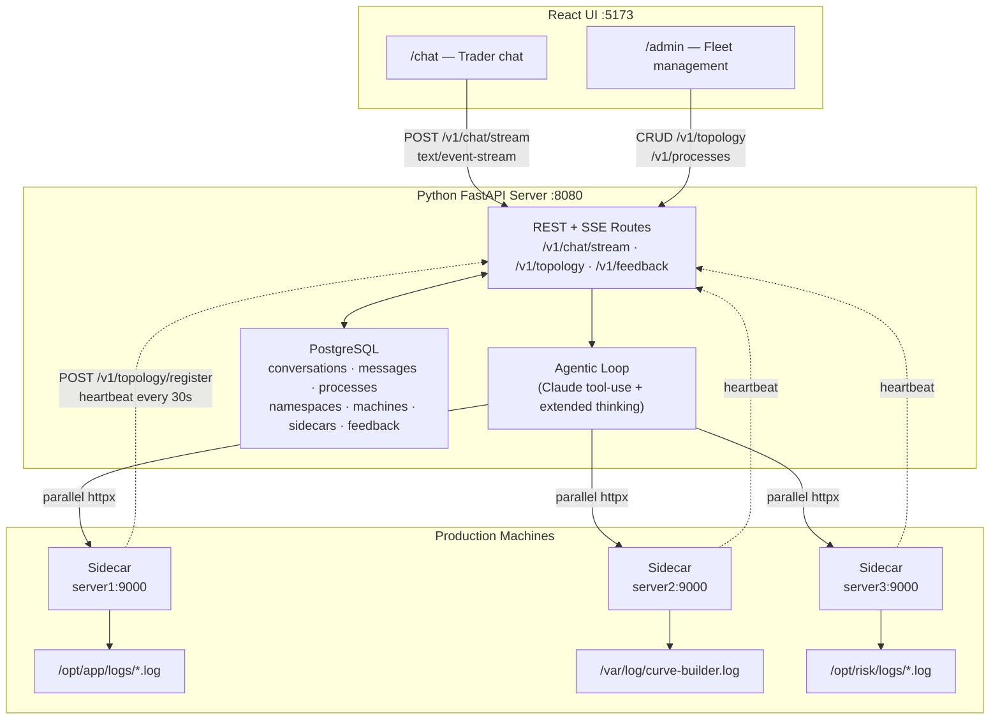
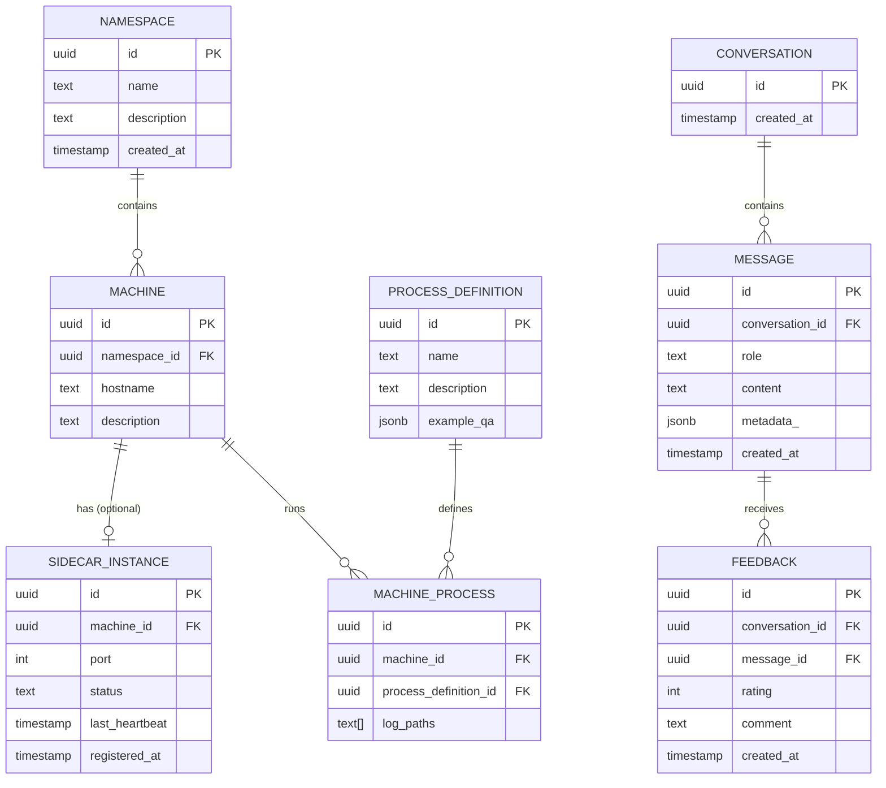
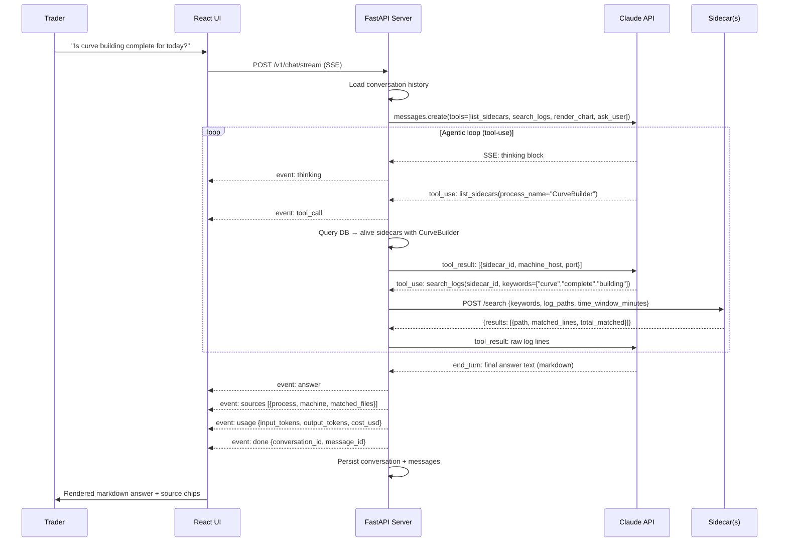
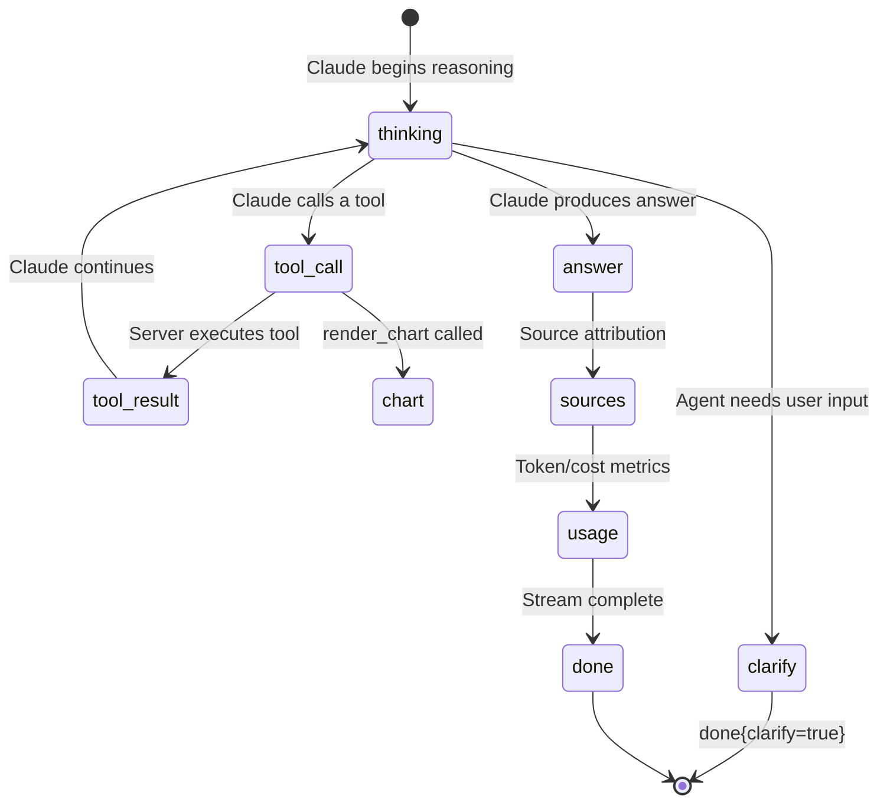
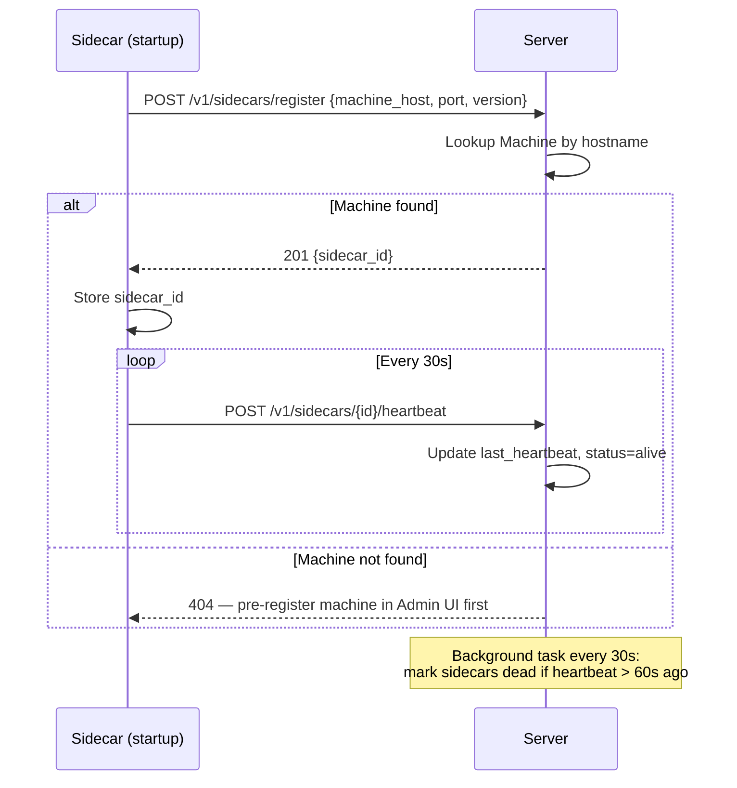

# LogSight Architecture

## System Overview

LogSight is a distributed log intelligence system. Traders ask questions in plain English; an LLM agent fans out searches to lightweight Rust sidecars on each machine and returns a summarised answer.

---

## Fleet Topology Data Model

---

## Agentic Loop — Query Flow

---

## SSE Event Stream

When a trader sends a question, the server responds with a `text/event-stream`. Each line is a JSON object:

---

## Sidecar Self-Registration

